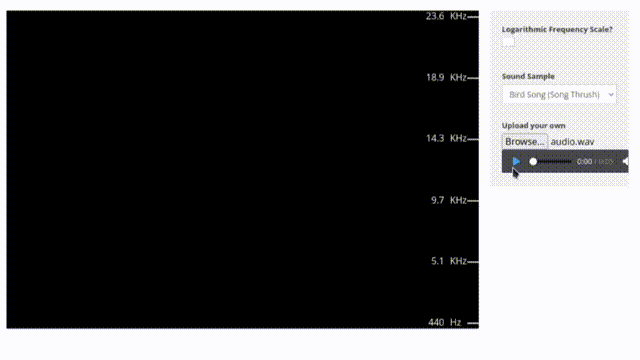

Convertergram is a program that converts an image file into an audio file. The interesting part is that, when the audio is played and visualized with a spectrogram, the original image can be seen inside it.

A spectrogram is a visual representation of the frequencies contained in an audio signal over time. In simple terms:

The x-axis shows time.

The y-axis shows frequency.

The colors/brightness represent how strong each frequency is at a given time.

This program takes an image (for example, targetimg.png) and encodes its pixels into audio frequencies. When you later generate or view the spectrogram of the output audio, the original image will appear hidden inside.

Example: 

```sh
python convertgram.py targetimg.png output.wav
```

targetimg.png → the input image file.

output.wav → the generated audio file.

Extra option: --spectrogram

If you run the program with the --spectrogram flag, it will not only generate the audio but also directly show the spectrogram of the resulting sound. That way, you can immediately see how your image looks when hidden inside the audio signal.


